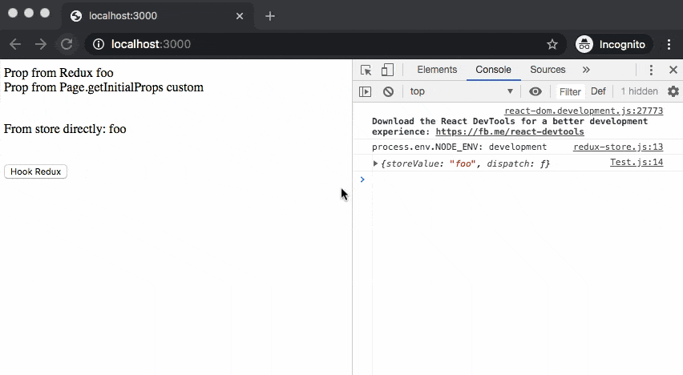

# **Nextjs + Redux**

Simple Nextjs+Redux usage.



For more detail, please refer to [Redux Wrapper for Next.js](https://github.com/kirill-konshin/next-redux-wrapper#installation)

## **Requirement / Software dependencies**

 - [Node.js](https://nodejs.org/en/) - A JavaScript runtime built on Chrome's V8 JavaScript engine.
 - [Next.js](https://nextjs.org/) - Lightweight React wrapper (recommended version 9+).
 - [Redux wrapper for Next.js](https://github.com/kirill-konshin/next-redux-wrapper) - A HOC that brings Next.js and Redux together.
 - [Redux logger](https://github.com/LogRocket/redux-logger) - Logger for Redux

## **Installation**

```bash
$ npm i --save next next-redux-wrapper react react-dom react-redux redux redux-logger
```

## **Usage**

### **1. Create store with Redux wrapper**

 - Preparing Redux's middleware for logger (in development environment only)
 - Preparing reducer
 - Create new store with the reducer and middleware

**Note:** 

By default, Redux logger print out information in browser's console(client side). Except your log is in server side scope(ex. `getInitialProps()`), it will print result out into cmd.exe(for window) or terminal(for mac) only.

#### Full source

```jsx
// Ref: ./helper/redux-store.js

import { applyMiddleware, createStore, compose } from "redux";

// Activate logger when it is in development environment
const middlewares = [];
console.log('process.env.NODE_ENV:', process.env.NODE_ENV);
if (process.env.NODE_ENV == 'development') {
    const { logger } = require(`redux-logger`);
  
    middlewares.push(logger);
}

/**
 * Reducer
 * 
 * storage handler/manager
 * @param {*} state state holder or storage
 * @param {*} action new data object which was sent by client to set into current state
 */
const reducer = (state = {foo: ''}, action) => {
    switch (action.type) {
        case 'FOO':
            // In this case, if type of data is "FOO" then 
            // adding data to attribute "foo" into current state.
            // If state didn't declare, set it with {foo: ''}
            return {...state, foo: action.payload};

        case 'CHANGE_STORE_VALUE':
            return {...state, foo: action.storeValue};
        default:
            return state
    }
};

/**
 * makeStore
 * 
 * create new store
 * @param {object} initialState The store's initial state (on the client side, the state of the server-side store is passed here)
 * @param {boolean} options.isServer Indicates whether makeStore is executed on the server or the client side
 * @param {Request} options.req Node.js `Request` object (only set before `getInitialProps` on the server side)
 * @param {Response} options.res Node.js `Response` object (only set before `getInitialProps` on the server side)
 * @param {boolean} options.debug User-defined debug flag
 * @param {string} options.storeKey The key that will be used to persist the store in the browser's `window` object for safe HMR
*/
const makeStore = (initialState, options) => {
    // return compose(applyMiddleware(...middlewares))(createStore)(reducer, initialState);
    return createStore(reducer, initialState, applyMiddleware(...middlewares));
};

export { makeStore };
```

### **2. Create higher-order components in main app**

 - Wrapping main Next.js's component with Redux's provider and apply store into it.

    ```js
    ...

    render() {
        // ctx or context -> props
        const { Component, pageProps, store } = this.props;
        return (
            <Provider store={store}>
                <Component {...pageProps} />
            </Provider>
        );
    }
    ```

 - [option] In this scope, you can set some data into the store via `ctx.store.dispatch` in `getInitialProps(...)`(server side)

    ```jsx
    static async getInitialProps({Component, ctx}) {

        // For dispatching, we can dispatch from here(_app.js)
        // or specific page in "Page.getInitialProps" by using
        // this.props.store
        ctx.store.dispatch({type: 'FOO', payload: 'foo'});

        const pageProps = Component.getInitialProps ? await Component.getInitialProps(ctx) : {};

        // Set to props
        return {pageProps};
    }
    ```

 - Wrapping the `redux-store` that we created with `withRedux` and apply it into the App.

    ```jsx
    export default withRedux(makeStore)(MyApp);
    ```

#### Full source

```jsx
// Ref: ./pages/_app.js

import React from "react";
import { makeStore } from "../helper/redux-store";
import { Provider } from "react-redux";
import App from "next/app";
import withRedux from "next-redux-wrapper";

class MyApp extends App {
    static async getInitialProps({Component, ctx}) {

        // For dispatching, we can dispatch from here(_app.js)
        // or specific page in "Page.getInitialProps" by using
        // this.props.store
        ctx.store.dispatch({type: 'FOO', payload: 'foo'});

        const pageProps = Component.getInitialProps ? await Component.getInitialProps(ctx) : {};

        // Set to props
        return {pageProps};
    }

    render() {
        // ctx or context -> props
        const { Component, pageProps, store } = this.props;
        return (
            <Provider store={store}>
                <Component {...pageProps} />
            </Provider>
        );
    }
}

export default withRedux(makeStore)(MyApp);
```

### **3. Using the store**

 - Using `connect` of `react-redux` to access the store from the HOC, now the store is `props`

    ```jsx
    // Ref: ./pages/index.js

    import React from "react";
    import {connect} from "react-redux";

    import TestComponent from '../components/Test';

    const Page = props => (
        <div>
            <div>Prop from Redux {props.foo}</div>
            <div>Prop from Page.getInitialProps {props.custom}</div>
            <TestComponent/>
        </div>
    );

    Page.getInitialProps = ({store, isServer, pathname, query}) => {

        // For dispatching, we can dispatch from here(_app.js)
        // or specific page in "Page.getInitialProps" by using
        // this.props.store
        // store.dispatch({type: 'FOO', payload: 'foo'});

        // To test adding the new one to store
        return { custom: 'custom' };
    }

    export default connect(state => state)(Page);
    ```

 - In case your component need to update data in the store, you need to use Redux hook with `useSelector` and `useDispatch` instead of `connect`

#### Full source

```jsx
// Ref: ./components/Test.js

import React from 'react'
import { 
    // Use "useSelector" and "useDispatch" for Redux hooks 
    useSelector, useDispatch 
} from "react-redux";

class TestComponent extends React.Component {

    constructor(props) {
        super(props);
    }

    componentDidMount(){
        console.log(this.props);
    }

    triggerChange(e) {
        this.props.dispatch({
            type: 'CHANGE_STORE_VALUE',
            storeValue: 'new store value'
        })
    }

    render() {
        return (
            <div>
            <br/>
            <p>From store directly: {this.props.storeValue}</p>
            <br/>
            <button onClick={(e) => {this.triggerChange(e)}}>Redux Hook Store</button>
            </div>
        )
    }
}

export default function Test(){

    // Get current state of specific attribute name in store
    const storeValue = useSelector(state => state.foo)
    // Get Redux dispatcher, preparing to update data to store
    const dispatch = useDispatch()

    return (
        <TestComponent 
            storeValue={storeValue}
            dispatch={dispatch}
        />
    );
};
```

## **License**

MIT